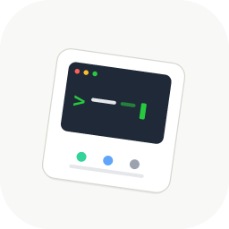

<p align="center">
  
</p>

<h1 align="center">OpenCodeDeck</h1>

<p align="center">
  一个用于监管 <code>opencode serve</code> 与 <code>opencode-im-bridge</code> 子进程的桌面控制面板。
</p>

<p align="center">
  <a href="#中文">中文</a> | <a href="#english">English</a>
</p>

---

## 中文

### 简介

OpenCodeDeck 是一个基于 Tauri 2（React 19 + Vite + Rust）的桌面应用，启动并监管两个子进程：`opencode serve`（服务器）和 `opencode-im-bridge`（IM 桥接）。支持 macOS 与 Linux。

### 特性

- **多服务器管理** —— 支持配置多个 `opencode` 服务器实例，独立启动/停止，托盘菜单实时显示各进程状态。
- **托盘集成** —— 关闭主窗口仅隐藏至托盘，通过托盘菜单退出时会先停止所有进程。
- **微信二维码检测** —— 自动解析 bridge 输出中的微信登录二维码（ASCII 块或 URL 格式），在前端展示。
- **Bridge 自动安装** —— 首次启动时自动 git clone `opencode-im-bridge`，支持更新与重装。
- **健康检查** —— 每 5 秒轮询服务器状态，异常时自动标记。
- **跨平台 PATH 增强** —— GUI 应用也能正确找到 `opencode`、`bun`、`node`、`git`（homebrew / nvm / snap 等）。

### 快速开始

#### 前置依赖

- [Node.js](https://nodejs.org/)（建议 18+）
- [Rust](https://www.rust-lang.org/)（stable 工具链）
- [opencode](https://github.com/sst/opencode) CLI
- macOS：Xcode Command Line Tools
- Linux：`webkit2gtk`、`libayatana-appindicator` 等系统库（见 [Tauri 2 前置要求](https://v2.tauri.app/start/prerequisites/)）

#### 开发

```bash
npm install
npm run tauri dev
```

这会在 1420 端口启动 Vite 开发服务器，然后启动 Tauri 应用。

#### 构建

```bash
# macOS
npm run tauri build

# Linux
npm run build:linux
```

### 架构概览

Tauri 2 桌面应用（React 19 + Vite + Rust），后端生成并监管两个子进程：

| 子进程 | 作用 |
|--------|------|
| `opencode serve` | opencode 服务器，提供会话 API |
| `opencode-im-bridge` | IM 桥接，对接微信等即时通讯平台 |

前端通过 `src/lib/tauri.ts` 与 Rust 后端通信，Rust 发射事件（`state://update`、`log://entry`、`health://update`、`wechat://qrcode` 等）供前端监听。

### License

[MIT](LICENSE)

本项目依赖于以下上游项目，在此向其作者致谢：

- [opencode](https://github.com/sst/opencode) —— AI 编程 CLI 与会话服务器
- [opencode-im-bridge](https://github.com/ET06731/opencode-im-bridge) —— IM 桥接服务

---

## English

### Introduction

OpenCodeDeck is a Tauri 2 (React 19 + Vite + Rust) desktop application that launches and supervises two child processes: `opencode serve` (server) and `opencode-im-bridge` (IM bridge). Supports macOS and Linux.

### Features

- **Multi-Server Management** — Configure multiple `opencode` server instances with independent start/stop control; tray menu shows real-time per-process status.
- **Tray Integration** — Closing the main window only hides it to the tray; quitting via the tray menu stops all processes first.
- **WeChat QR Code Detection** — Automatically parses WeChat login QR codes (ASCII block or URL format) from bridge output and displays them in the frontend.
- **Bridge Auto-Install** — Auto-clones `opencode-im-bridge` via git on first launch, with update and reinstall support.
- **Health Check** — Polls server status every 5 seconds and marks failures automatically.
- **Cross-Platform PATH Enhancement** — Ensures the GUI app can find `opencode`, `bun`, `node`, `git` (homebrew / nvm / snap, etc.).

### Quick Start

#### Prerequisites

- [Node.js](https://nodejs.org/) (18+ recommended)
- [Rust](https://www.rust-lang.org/) (stable toolchain)
- [opencode](https://github.com/sst/opencode) CLI
- macOS: Xcode Command Line Tools
- Linux: `webkit2gtk`, `libayatana-appindicator`, and other system libraries (see [Tauri 2 prerequisites](https://v2.tauri.app/start/prerequisites/))

#### Development

```bash
npm install
npm run tauri dev
```

This starts the Vite dev server on port 1420, then launches the Tauri app.

#### Build

```bash
# macOS
npm run tauri build

# Linux
npm run build:linux
```

### Architecture

Tauri 2 desktop app (React 19 + Vite + Rust) whose backend spawns and supervises two child processes:

| Process | Purpose |
|---------|---------|
| `opencode serve` | opencode server providing session APIs |
| `opencode-im-bridge` | IM bridge connecting to WeChat and other platforms |

The frontend communicates with the Rust backend via `src/lib/tauri.ts`; Rust emits events (`state://update`, `log://entry`, `health://update`, `wechat://qrcode`, etc.) for the frontend to listen to.

### License

[MIT](LICENSE)

This project depends on the following upstream projects. Credit to their authors:

- [opencode](https://github.com/sst/opencode) — AI coding CLI and session server
- [opencode-im-bridge](https://github.com/ET06731/opencode-im-bridge) — IM bridge service
